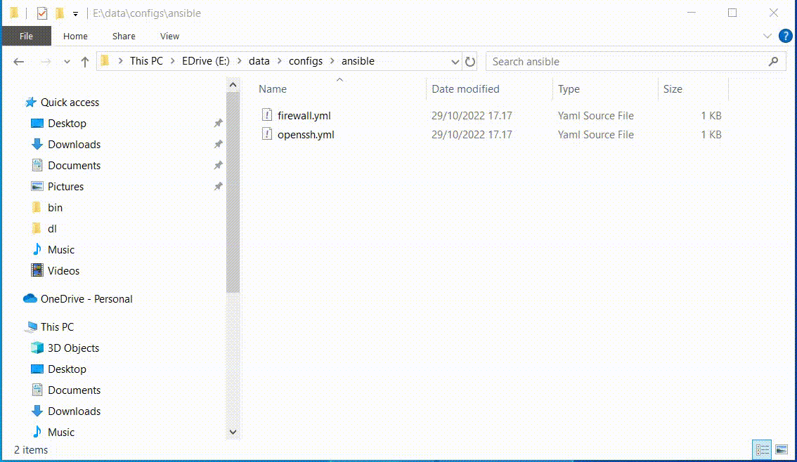

# simpleversionbackup

Saving versions of files can be made easier with a powershell script which makes a timestamped copy of a file or directory. After making a timestamped version you can continue editing
the same file. For example you are editing file main.rs and you want to make intermediate version backup. Right click main.rs and select send to SaveVersion.bat and you will have new file
main-20240410-135017.rs in the same directory. Time stamp is in format yyyyMMdd-HHmmss.

In Win10 you can add items into File Explorer context menu and I added my version backup script into that "right click" menu.

Two files are needed. A SaveVersion.bat file which shall be copied to users SendTo directory. SaveVersion.bat will call powershell script MakeBackup.ps1 which will do time stamped copy of
the selected file or directory.

Users SendTo directory is for e.g. 
C:\Users\Matti\AppData\Roaming\Microsoft\Windows\SendTo\

MakeBackup.ps1 you can save where you want. In SaveVersion.bat file you have to edit line
set "bindir=E:\data\bin"
to point to directory where you saved MakeBackup.ps1.
